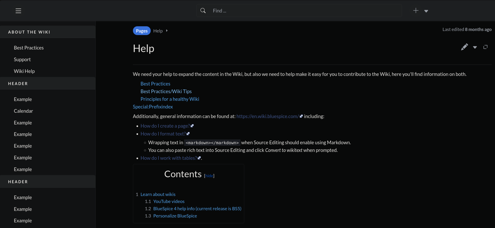

# DarkMode

A proper dark mode extension for MediaWiki. No `filter: invert()` — all colors are explicitly defined using CSS custom property overrides and direct selectors.

Built for **BlueSpice Discovery** skin but maintains compatibility with Vector and other skins.



## Installation

```bash
git clone https://github.com/mackcoding/mediawiki-extensions-DarkMode.git extensions/DarkMode
```

Add to `LocalSettings.php`:

```php
wfLoadExtension("DarkMode");
$wgDarkModeTogglePosition = "navbar"; // navbar, personal, sidebar, or footer
```

## Toggle Positions

| Position | Description |
|----------|-------------|
| `navbar` | Icon in the top navbar next to gear/bell icons (BlueSpice Discovery) |
| `personal` | In the Personal Tools dropdown |
| `sidebar` | In the sidebar navigation |
| `footer` | In the page footer |

## What's Different

This is a complete rewrite of the [upstream DarkMode extension](https://www.mediawiki.org/wiki/Extension:DarkMode). Key changes:

- **No filter:invert()** — every color is explicitly set
- **139 BlueSpice Discovery CSS custom properties** overridden for full skin coverage
- **jQuery UI / FullCalendar support** — datepickers, SRF event calendars
- **VisualEditor toolbar** — dark toolbar, popups, save button, editor switch
- **Inline style overrides** — wiki content with hardcoded `background:#fff` or `color:#000`
- **Navbar toggle** — Bootstrap Icon (moon/sun) injected into BlueSpice Discovery navbar via JS
- **User preference persistence** — saves via MediaWiki API for logged-in users, cookie for anonymous

## Requirements

- MediaWiki >= 1.40.0
- MIT License
